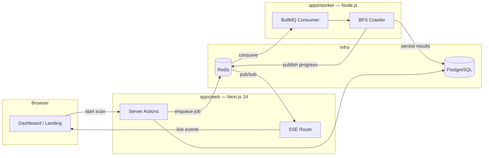

<div align="center">

# 🔗 DeadLink Sentinel

**Continuous site-health monitoring — catch link rot before your users do.**

[](https://github.com/muntasirhossain2003/DeadLink-Sentinel/actions/workflows/ci.yml)
[](https://www.typescriptlang.org/)
[](https://nextjs.org/)
[](https://www.prisma.io/)
[](LICENSE)

*Links die. Anchors vanish. Redirects pile up. DeadLink Sentinel sweeps your site like sonar and pings you the moment something breaks.*

</div>

---

## Why this exists

A page that returns `200 OK` can still be broken. Documentation sites decay silently:

- **Dead links** — a route gets removed; three pages still point to it.
- **Broken anchors** — a heading gets renamed and every `#fragment` link to it lands nowhere. No 404, no warning. Almost no tool checks this.
- **Redirect chains** — three hops where one would do; slow for users, leaky for SEO.
- **Content decay** — missing alt text, vanished titles, dropped meta descriptions.

Sentinel detects all four in one crawl, computes a weighted **health score (0–100)**, tracks it over time, and streams live progress to your browser while it works.

## Features

| | Feature | Status |
| --- | --- | --- |
| 🕸️ | Breadth-first crawler with robots.txt compliance and per-domain rate limiting | ✅ MVP |
| 🔍 | Link classification: `OK` / `BROKEN` / `REDIRECT` / `BROKEN_ANCHOR` | ✅ MVP |
| ⚓ | `#fragment` anchor verification against real heading IDs | ✅ MVP |
| 📡 | Live scan progress via Server-Sent Events + Redis pub/sub | ✅ MVP |
| 📊 | Health score timeline chart across scans | ✅ MVP |
| 🎯 | Visitor demo scan — 25 pages free, no signup, IP rate-limited | ✅ MVP |
| 🔐 | Auth.js v5 — GitHub OAuth + email magic links | ✅ MVP |
| 🛡️ | SSRF prevention — DNS resolution + private IP range rejection | ✅ MVP |
| ⏰ | Scheduled re-scans, email alerts, scan diffing (`NEW`/`RECURRING`/`FIXED`) | 🔜 Phase 2 |
| 🤖 | GitHub PR comments, public status badges | 🗺️ Phase 3 |

## Architecture



**The web app never crawls.** Scan jobs are queued in Redis (BullMQ) and consumed by an independent worker process — long-running crawls can't block or crash web requests, and the worker scales horizontally. Progress events flow back through Redis pub/sub into a Server-Sent Events stream (chosen over WebSockets: progress is one-directional, and SSE needs no protocol upgrade).

## Health score

`score = 100 − Σ(penalty × count)` — each category capped so one systemic issue can't zero an otherwise healthy site.

| Issue | Penalty | Cap | Rationale |
| --- | ---: | ---: | --- |
| Broken internal link | −5 | −50 | Fully within your control; most damaging |
| Broken anchor | −3 | −15 | Invisible failure — page loads, reader lost |
| Broken external link | −2 | −20 | Annoying, but not yours to fix |
| Redirect chain (≥2 hops) | −1 | −10 | Performance and SEO drag |

## Tech stack

| Layer | Choice | Why |
| --- | --- | --- |
| Full-stack framework | **Next.js 14** (App Router) | Server Components cut client JS; Server Actions remove API boilerplate |
| Language | **TypeScript** (strict) | Link results modeled as discriminated unions — the compiler forces every failure mode to be handled |
| Database | **PostgreSQL + Prisma** | Relational integrity fits scan → page → link-check data |
| Job queue | **BullMQ + Redis** | Decouples crawling from web requests; retries + backoff built in |
| Live updates | **SSE + Redis pub/sub** | Simpler than WebSockets for one-way progress |
| Auth | **Auth.js v5** | GitHub OAuth + magic links |
| Validation | **Zod** | One schema = runtime validation + static type |
| Parsing | **cheerio + undici** | Fast server-side HTML parsing, no headless browser |
| UI | **Tailwind CSS + Recharts** | Design-system tokens + health timeline chart |
| Deploy | **Railway** | Web + worker + Postgres + Redis in one project |

## Project structure

```text
deadlink-sentinel/
├── apps/
│   ├── web/                  # Next.js 14 — dashboard, landing, API routes
│   │   ├── app/
│   │   │   ├── (marketing)/  # landing page + demo scan
│   │   │   ├── (auth)/       # sign-in
│   │   │   ├── (dashboard)/  # protected: sites, scans, reports
│   │   │   └── api/          # SSE stream, demo scan, auth
│   │   ├── actions/          # Server Actions (createSite, startScan…)
│   │   ├── components/
│   │   └── lib/              # auth, redis, queue, SSRF guard
│   └── worker/               # BullMQ consumer
│       └── src/
│           ├── crawler/      # fetcher, robots, parser, classifier, BFS engine
│           └── queue/
├── packages/
│   ├── db/                   # Prisma schema + singleton client
│   └── shared/               # domain types, Zod schemas, health score
└── .github/workflows/        # CI: prisma generate → typecheck → lint → test
```

## Getting started

**Prerequisites:** Node 20+, PostgreSQL 14+, Redis 6+

```bash
# 1. Clone and install
git clone https://github.com/muntasirhossain2003/DeadLink-Sentinel.git
cd DeadLink-Sentinel
npm install

# 2. Configure environment
cp .env.example .env       # then fill in DATABASE_URL, REDIS_URL, auth secrets

# 3. Set up the database
npm run db:generate
npm run db:migrate

# 4. Run both processes (separate terminals)
npm run dev                            # web  → http://localhost:3000
npm run dev --workspace=apps/worker    # worker
```

Run the test suite:

```bash
npm test
```

## Crawler politeness

These rules are hard-coded and cannot be disabled by users:

- Fetches and obeys `robots.txt` (including `Crawl-delay`) before any crawl
- Identifies itself: `DeadLinkSentinel/1.0 (+site URL)`
- Maximum 2 requests/second per domain
- One concurrent scan per site; hard page caps per tier
- Rejects private/reserved IP targets (SSRF guard) — on both the web and worker side

## License

MIT — built as a capstone project by [Asif](https://github.com/muntasirhossain2003).
